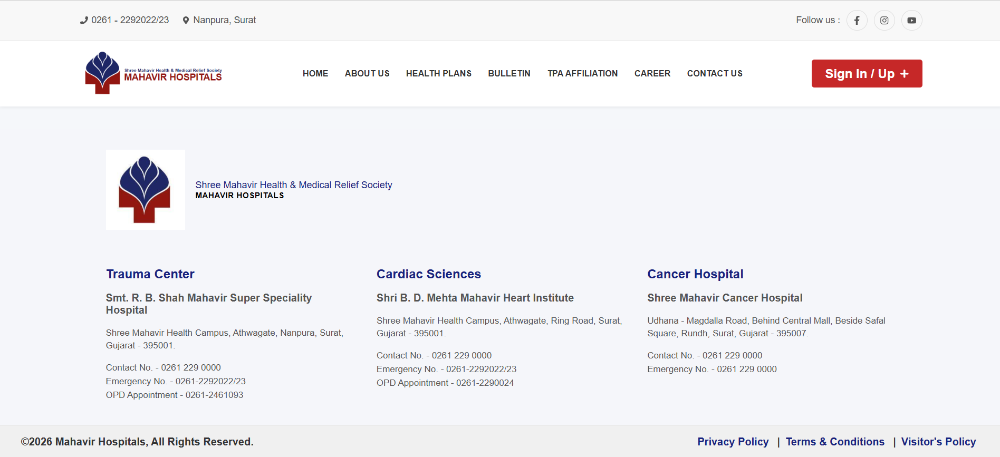

# Project Screenshots

## About section

## About Us page

## Additional Feedback page

## Admin Dashboard

## Affiliations section

## Be In Touch For Updates section

## Bulletin Page

## Career page

## Contact Us page

## Edit Doctor page

## footer

## Forgot Password page

## Health Plans Page

## Hero Section of Hospital System

## Hospital Information section

## locations section

## Login page

## Manage Doctor Registration page

## Objectives section

## Password Reset Page

## Patient Profile page

## Privacy Policy page

## Provide Feedback page

## Sign Up page

## Terms and Condition page

## TPA Affiliation page

## Verify OTP page

## View Doctors page

## View Registered Doctors page

## View Registered Users page

## Visitor Policy page

---

# Maha.Hosp

This is my summer internship project on live website development of a Hospital.

## Technologies and Tools Used

### Frontend
- ReactJS
- HTML
- CSS

### Backend
- NodeJS
- ExpressJS

### Database
- MongoDB Atlas
- Mongoose

### Tools
- Postman (API Testing)
- GitHub (Version Control)
- VS Code (Code Editor)
- PayPal (Dummy Payment Integration)
- Google Maps API (for displaying location)

I have implemented MERN stack technologies to develop my entire website for Hospital System for my Internship.

I have learnt about how should be approach to design any Website from scratch like what should be the roadmap etc...

I also came to know about how to design the database to minimize the data redunduncy and work with MongoDB Atlas efficiently.

Other than this, I also learnt about Frontend and Backend Implementation and how to connect both and the connection with MongoDB using Mongoose.